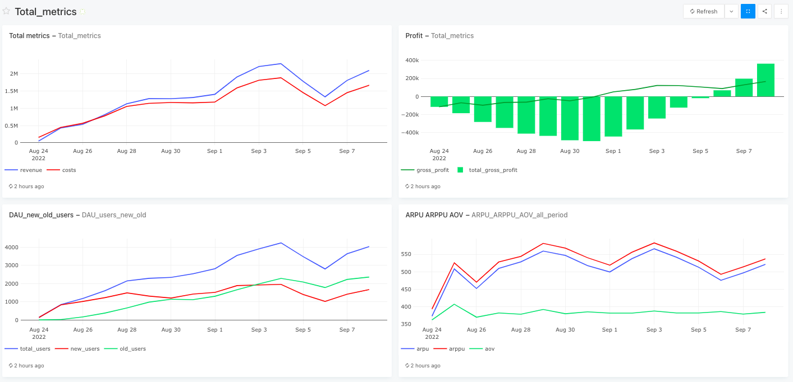
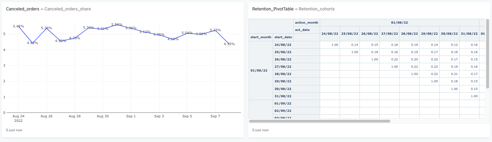

# E-Commerce Health Check: Financial Metrics , Unit Economics & Operational Dashboard (Redash)

This project presents an E-Commerce Health Check Dashboard built in Redash using PostgreSQL. 
The dashboard monitors company health across four areas: financial performance (P&L), audience growth (DAU, Retention), 
monetization (ARPU, ARPPU, AOV), and operational stability (Canceled orders share). 

**Live Dashboard Link:** [View Interactive Dashboard in Redash](https://redash.public.karpov.courses/dashboards/10958-total_metrics)

---

## Tech Stack
* **Database:** `PostgreSQL`
* **BI & Visualization:** `Redash`
* **SQL Techniques:** `CTEs`, `Window Functions` (`SUM OVER`, `COUNT DISTINCT OVER`), `Aggregations`, `CASE WHEN`, `UNNEST`, `FULL OUTER JOIN`, `Pivot Data Structures`
* **Analytical Frameworks:** Unit Economics (`CAC`, `ROI`, `Payback Period`), Cohort Analysis (`Retention Rate`)
---

## Dashboard Preview

## SQL Queries & Dashboard Structure

### 1. Financial Metrics
* **Dashboard Widgets:** Total Metrics (Revenue, Costs) & Profit Trend.
* **SQL Query:** [01_financial_metrics.sql](sql/01_financial_metrics.sql)
* **Key Takeaways:**
  * **Revenue Growth:** Revenue shows a strong positive trend. The service is new and growing. 
  * **Weekend Effect:** Growth peaks on Friday–Sunday when food delivery demand is highest. From Sep 2 to 4, revenue increased from
     1.4M to 2.3M RUB.
  * **Mid-week Dip:** A temporary drop occurs around Sep 6 ( revenue 1.3M RUB), showing probable weekly seasonality.
  * **Cost Optimization:** Initially, costs exceeded revenue. After Sep 1, revenue outgrew costs due to changes in fixed/variable cost logic.
  * **Daily Break-even:** Daily action profit turned positive on September 1st right after cost model updates.
  * **Cumulative Break-even:** Cumulative overall project profit reached positive values on September 6th.
  * **Current Dynamic:** Upward trend for both daily profit and cumulative profit (100-150K RUB daily profit). 

### 2. User Growth & Audience Structure
* **Dashboard Widget:** DAU (New vs Returning Users).
* **SQL Query:** [02_dau_new_old_users.sql](sql/02_dau_new_old_users.sql)
* **Key Takeaways:**
  * **User Dynamic:** Overall active audience shows a healthy upward trend with stable new user acquisition.
  * **Mid-week Dip:** A clear drop occurred on September 6th, confirming weekly seasonality.
  * **Audience Balance:** The decline affected both new and returning users equally, ruling out single-cohort issues.

### 3. Monetization 
* **Dashboard Widget:** ARPU, ARPPU, AOV Trends.
* **SQL Query:** [03_arpu_arppu_aov.sql](sql/03_arpu_arppu_aov.sql)
* **Key Takeaways:**
  * **Order Frequency:** ARPU and ARPPU growth is driven by purchase frequency, as AOV remains flat (~380–400 RUB).
  * **Parallel Curves:** ARPU and ARPPU move in parallel, indicating that the share of canceled orders remained stable over time.
 

### 4. Order Cancellations
* **Dashboard Widget:** Canceled Orders Share (%).
* **SQL Query:** [04_canceled_orders_share.sql](sql/04_canceled_orders_share.sql)
* **Key Takeaways:**
  * **Operational Health:** Order cancellation rate is stable at around ~5%.
  * **Root Cause Check:** This stability proves that the drop in DAU and revenue on September 6th was not caused by technical failures.

### 5. User Retention & Cohort Analysis
* **Dashboard Widget:** Retention Pivot Table (Cohorts).
* **SQL Query:** [05_retention_cohorts.sql](sql/05_retention_cohorts.sql)
* **Key Takeaways:**
  * **Cohort Analysis:** Tracks cohort drop-offs to evaluate long-term retention and marketing acquisition quality.

## Executive Summary

* **Financial Health:** Revenue and cost dynamics are on an upward trend. Cost model optimizations on September 1st successfully shifted the project into profit.
* **Break-even Timeline:** Daily profit reached break-even on September 1st, and cumulative project profit turned positive on September 6th.
* **Seasonality vs Operations:** The dip on September 6th was caused by normal weekly seasonality (affecting both new and old users equally), while operational metrics remained healthy with cancellations stable at ~5%.
* **Growth Driver:** Monetization growth (ARPPU) is driven by increased purchase frequency per user rather than price changes, as AOV stayed flat (~380–400 RUB).

